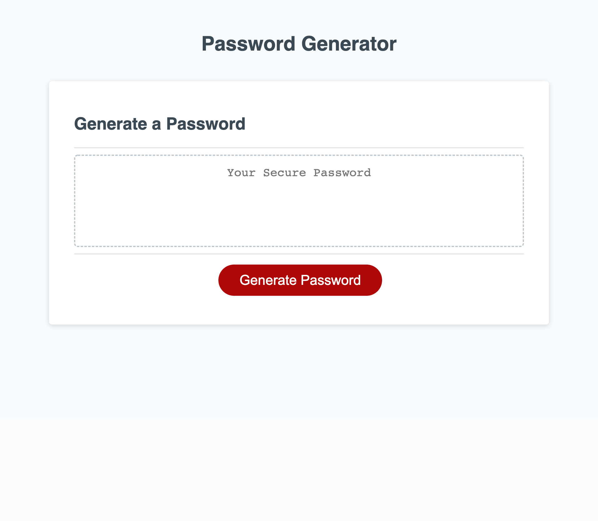

# challenge-03 Javascript Challenge: Password Generator

## **Table of Contents**
* [The Repository](#the-repository)
* [The Scenario](#the-scenario)
* [The Process](#the-process)
* [Requirements Met](#requirements-met)
* [Requirements Outstanding](#requirements-outstanding)
* [Result](#result)

### **The Repository**
This repository (challenge-03) contains HTML code, a CSS stylesheet, and a script.js sheet for Javascript code meant for the construction of a random password generator for Week 3 of University of Arizona Coding Boot Camp.

### **The Scenario**
The task was to create a random password generator based on criteria the User selects. 

### **The Process**
Starter code was provided for this project. I wrote (and rewrote and rewrote) the Javascript.

### **Requirements Met**
* When the Generate Password button is clicked, the User is presented with a dialogue box.
* The dialogue box includes prompts for password length (8-128 characters) and the selection of symbols, lowercase, and/or uppercase letters to be included in the password.
* User's answers are validated by alerts.

### **Requirements Outstanding**
* The password does not generate in the box.

### **Result**
Most of the requirements were met except the most important one, which is actually generating the password. As of the 9/16/22 update and resubmit, this issue has been resolved. Password now generates.

You can find my site at [Challenge-03](https://jlmayo.github.io/challenge-03/)

## **Completed Project**

